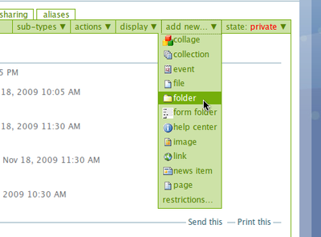
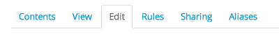
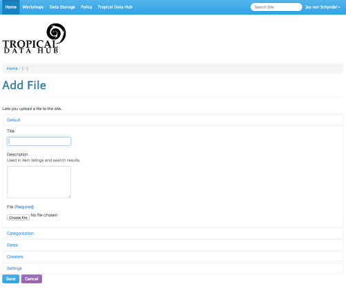
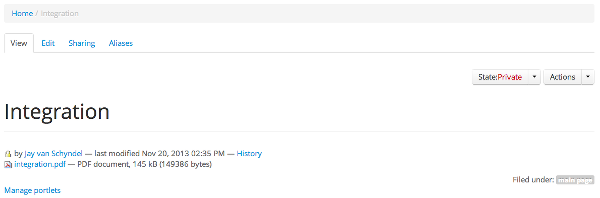
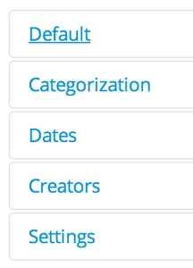

Adding and Editing Content
**************************

**How to add and edit content in Plone.**

Creating a new content item
===========================

What kind of content can I post?
--------------------------------

As a member of the site, you have been automatically granted access to 
add/edit/delete content.

The following table lists the basic types of documents that Plone can store.
There may be others based on your group's needs.

+--------------+-------------------------------------------------------------+
| Content Type | Description                                                 |
+==============+=============================================================+
| Page         | Contains text content, may include HTML                     |
+--------------+-------------------------------------------------------------+
| Link         | A hypertext link to another item in Plone or to an external |
|              | item                                                        |
+--------------+-------------------------------------------------------------+
| Image        | A picture, usually ending with extension jpg, gif, etc      |
+--------------+-------------------------------------------------------------+
| Folder       | Similar to a folder on a drive, can contain content         |
+--------------+-------------------------------------------------------------+

Creating new content
--------------------

Follow the steps listed below to create a new content item.

1. Navigate to the portal
2. Make sure you are logged in
3. You should now see the Plone bar.
4. Click the *Add new* item menu, and you will see a list of 
   document types that you can choose.

5. Choose the appropriate type of file from the drop-down menu.
6. Fill in the form.  Only the fields with a red box are required.
7. Click the Save button 

Editing existing content items
==============================

You can edit any item that you have created or that you have been granted
access to.

To edit a content item:

* Click onto the given content item you want to edit
* Click on the Edit tab

* Edit the content item, changing whatever you'd like to
* Add some comments to the Change Note field to describe your change.
* Click the Save button

What kind of content can I post?
================================

As a member of the portal, you have automatically been granted access to
add/edit/delete content. Based on the security needs
of your group, you may also be granted access to other folders in your portal.
You'll know what you've got access to if you can see the 'View', 'Edit',
'Sharing' and other tabs at the top of some content.

The following table lists the basic types of documents that Plone can store.
There may be others based on your group’s needs.

+--------------+------------------------------------------------------------+
| Content Type | Description                                                |
+==============+============================================================+
| Collection   | A grouping of other content. Similar to a saved search, in |
|              | that content of a certain type is grouped together. Topics |
|              | can only be added by an admin.                             |
+--------------+------------------------------------------------------------+
| Event        | An upcoming event, meeting, conference, etc. Appears under |
|              | the events tab.                                            |
+--------------+------------------------------------------------------------+
| File         | A piece of content, can be many different formats.         |
+--------------+------------------------------------------------------------+
| Folder       | Similar to a folder on a hard drive, it can contain        |
|              | content.                                                   |
+--------------+------------------------------------------------------------+
| Form Folder  | A folder that is used to build a form.                     |
+--------------+------------------------------------------------------------+
| Image        | This content type usually ends with an extension such is:  |
|              | gif, jpg, png, tif or pict.                                |
+--------------+------------------------------------------------------------+
| Link         | A hypertext link to another item in Plone or to an         |
|              | external item.                                             |
+--------------+------------------------------------------------------------+
| News Item    | A piece of content that appears under the news             |
|              | section. For example this could be a press release.        |
+--------------+------------------------------------------------------------+
| Page         | Contains text content that is to be formatted by Plone,    |
|              | includes HTML                                              |
+--------------+------------------------------------------------------------+
| Space        | A collaboration workspace that simulates a mini-Plone site |
|              | by acting as a site root for navigation purposes.          |
+--------------+------------------------------------------------------------+

Adding a pre-existing file
==========================

**You can upload files from your computer to the portal.**

The instructions below describe the steps to add a pre-existing file to the
site. The steps are similar for other types of content, such as images.

1. Make sure that you are logged into the portal.
2. Providing you have access, you should now see the Plone bar.
3. Select **File** from the **Add New** menu on the Plone bar.
4. Fill in the form. Only the fields with a red box are required.
5. Use the **Choose File** button to select the file from your computer or
   another location.
6. Click the **Save** button to finish.

Downloading this file again
---------------------------

You should now see a message saying that your changes have been saved. There
will be a link with the given file name you just uploaded. If you click on
this link you will be able to download the file to your computer. Extra
details regarding the files type, size and data modified are also listed.

.. _setting-the-document-metadata:

Setting the document metadata
=============================

**Document metadata is very important: the portal and your users needs to know
extra information about your content.**

Each item on a Plone portal has specific properties called "metadata" that are
associated with it. These metadata allow documents to be found easily via
searches and other queries to the system.

Keep in mind that metadata available will vary from one content type to
another. However, in general you will find the following values across the
different content types in the system:

+------------------+------------------------------------------------------+
| Metadata         | Description                                          |
+==================+======================================================+
| Title            | The title of the item                                |
+------------------+------------------------------------------------------+
| Description      | A short, one paragraph description of the item       |
+------------------+------------------------------------------------------+
| File             | The source file for the item                         |
+------------------+------------------------------------------------------+
| Body text        | You can cut and paste this in from other documents,  |
|                  | or type it in using the Plone editor.                |
+------------------+------------------------------------------------------+
| Related items    | Links to files already on the Plone system.          |
+------------------+------------------------------------------------------+
| Allow discussion | The default is to enable discussion, this can be     |
|                  | turned off                                           |
+------------------+------------------------------------------------------+
| Change note      | Enter a comment below to describe the changes you've |
|                  | made.                                                |
+------------------+------------------------------------------------------+

.. _setting-advanced-metadata-properties:

Setting advanced metadata properties
====================================

**You can control your content even further with advanced metadata properties.**

In order to aid the advanced searching capabilities of Plone, you can add
additional metadata to describe your item. To add this metadata, edit your
content, and look for these extra tabs:

The extra metadata items are described below. Keep in mind that some of these
aspects won't appear on all content types, or might appear under different tabs.

+-------------------------+------------------------------------------------+----------------+
| Metadata                | Description                                    | Found Under    |
+=========================+================================================+================+
| Categories/Tags         | Identifies the item by keywords used in search | Categorization |
+-------------------------+------------------------------------------------+----------------+
| Language                | By default, Plone is language neutral          | Categorization |
+-------------------------+------------------------------------------------+----------------+
| Publishing Date         | Can be used to delay making the content        | Dates          |
|                         | available. Date and time can be specified      |                |
+-------------------------+------------------------------------------------+----------------+
| Expiration Date         | After this date the content is no longer       | Dates          |
|                         | available. Date and time can be specified      |                |
+-------------------------+------------------------------------------------+----------------+
| Contributors            | Info about the people who contributed the item | Creators       |
+-------------------------+------------------------------------------------+----------------+
| Creators                | An item can have multiple creators, primary    | Creators       |
|                         | added first                                    |                |
+-------------------------+------------------------------------------------+----------------+
| Rights                  | Displays copyright info for this item          | Creators       |
+-------------------------+------------------------------------------------+----------------+
| Allow comments          | Allows users to add comments to this item      | Settings       |
+-------------------------+------------------------------------------------+----------------+
| Exclude from navigation | Item does not appear in the navigation tree    | Settings       |
+-------------------------+------------------------------------------------+----------------+

Creating a table of contents
============================
**A table of contents is a quick and easy way of helping your users navigate.**

If your page is lengthy, you may wish to add a table of contents with links to
each section of the page. This is easy to do, as long as you follow a few
simple steps.

To create a table of contents
-----------------------------

* Create the page as normal, typing or pasting in the content
* Divide your content up according to sections, using the *'Heading'* style from
  the drop-down menu to set your headings accordingly.
* If you have sub-sections, use the *'Subheading'* style from the drop-down menu
  to set your subheadings accordingly.
* Do this for all sections of the document. These headings and subheadings
  will appear as entries automatically in your table of contents.
* Before closing your document, click the **Settings** tab. 
* Place a tick in the **Table of Contents** checkbox
* Click the **Save**  button at the bottom of the page to save your page. 

You should now have a table of contents at the right side of your lengthy
page. Users can click onto entries in the table of contents to jump to those
sections instantly.

.. _creating-public-content:

Creating public content
=======================
**Whilst having space for personal content is helpful, you usually want to also publish content to the public.**

**Note:**  All content management is done in-place, unlike some other
content management systems. Essentially, where you put the content is where
it will appear.

1. Login to the portal and navigate to the folder where you would like to
   create the page.
2. Click Add New and choose your content type from the menu
3. Create the page or content as usual
4. Click the Save button to save your content.
5. Click the **State**  menu and choose **Publish** from the list.

   a. If you can't see this, then you don't have access to publish documents.
   
   b. You might see 'Submit for publication' under the menu instead. If you
      see this, click this and it will submit the content to your section
      administrator for approval.
   c. In any case, you'll need to contact your site or section administrator
      for access or to get them to publish the content for you.
