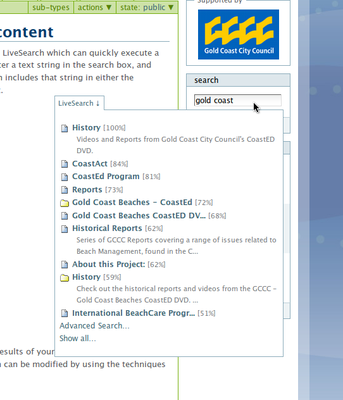

Collaboration using Plone
*************************

Adding comments to content
==========================
.. Comments are an important part of collaboration within your portal.

With the exception of folders, almost all types content can be enabled to
allow comments. If comments are enabled for a particular content item you
will see an **add comment**  button underneath the content

To enable comments for a single item
------------------------------------

1. Click onto the content item you want to enable comments on
2. Click onto the Edit tab at the top
3. Click onto the 'Settings' tab at the top of the page
4. Check the 'Allow comments' box. If you can't find the box here, it might
   be under a different tab (eg 'Properties') as you might be using a custom
   content type.
5. Click the Save button to commit the change.

.. image:: images/comments.png
   :alt: Add comments button

Adding comments
---------------

1. Click the Add Comment button, and when the form opens, enter a subject and
   text for the comment.
2. To save the comment, click the Save button at the bottom of the form.
3. Your comments appear inline underneath the content.

Searching for content
=====================
.. Your portal contains a search engine called LiveSearch which can quickly
   execute a full text search of all documents.

Enter a text string in the search box, and the site will search for all
content which includes that string in either the metadata or the text of the
document.

Viewing content via RSS
=======================
.. Rather than having to check each individual folder that may have content
   that you are interested in, you can view the RSS version of that file using
   an news reader.

RSS stands for **R**\eally **S**\imple **S**\yndication, and allows pages
to be viewed external to Plone or any other web publishing service.

Many web browsers have an RSS reader already installed, or offer plug-ins that
have this functionality.

Enabling syndication on a Folder/Collection
-------------------------------------------

1. Go to the folder or collection you'd like to enable syndication on.
2. Click onto the 'RSS' or 'Syndication' tab on the folder (naming depends on
   your site's configuration)
3. Click the 'Enable Syndication' button
4. Select how often you want your RSS feed updated.

 1. If you'd like it be updated frequently, then you can select a value like
    every 1 hour.
 2. Otherwise, if you don't want your newest content to go out so quickly 
    (for example, if you want to tentatively release information), then pick
    a slower update duration.

Viewing a feed
--------------

1. Go to the folder or collection you want to get a feed for.
2. Make sure syndication is enabled for the container.
3. Look at the document actions area (where 'send to' and 'print this' are)
   and you should see 'RSS Feed'
4. Click this, and use this URL in your news reader.

Viewing private feeds
---------------------

Plone won't expose private information in RSS feeds; you'll only see public
information because your RSS feed isn't being authenticated as anyone.
Essentially, by default, if you try to load an RSS feed in your reader, you'll
only see what a normal, unauthenticated user sees.

In order to be able to see Private content, you'll need to adjust your RSS URL
by adding the following **bold**  information to the address:

\http://www.site.com/folder/RSS\ **?__ac_name=USERNAME\&__ac_password=PASSWORD**

and substituting USERNAME and PASSWORD with your own values for the site.

You can now place this URL into your reader and see the Private content.
