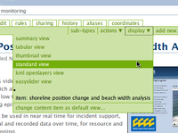
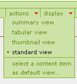

Folder display options
===========================

Display View
------------
The portal allows you to pick several ways to display the contents of a
folder. The standard view is listed below. To change the view, click the
display menu item from the Plone menu bar and choose the appropriate view
from the list.

.. tabularcolumns:: |l|l|

+-------------------------+-------------------------------------------------+
| Folder view             | Description                                     | 
+=========================+=================================================+
| Standard                | Lists all content items in the folder and give  |
|                         | Title, Description, Creator and Date details    |
+-------------------------+-------------------------------------------------+
| Summary                 | Lists Title and Description of the content      |
+-------------------------+-------------------------------------------------+
| Tabular                 | Lists the content items in a table format       |
+-------------------------+-------------------------------------------------+
| Thumbnail               | Lists the images in thumbnail form              | 
+-------------------------+-------------------------------------------------+
| Content item as default | Lets you set a content item contained within    |
|                         | this item as the home page for this folder      |
+-------------------------+-------------------------------------------------+

Change the home page for a folder
=================================

By default Plone displays a list of the contents of all folders and a brief
description. In order to change this view, you will need to create a new page
and set the folder to use this page as the default view for the folder.

1. After logging in to the portal, click into the folder you'd like to change.
   Make sure you've already created a page to set as its default view.
2. Click on the Display menu and pick "Select a content item as default view"

3. Select the item that you would like to be displayed as the default page of
   the folder and click the **Save**  button.
4. You should now be able to see the page appear as the default view for the
   folder. Keep in mind that you will need to publish this page for other
   users to see it.

