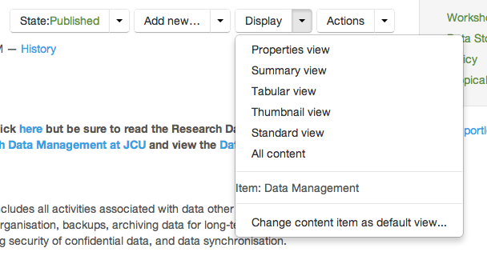

Folder display options
======================

Display View
------------
The portal allows you to pick several ways to display the contents of a
folder. The standard view is listed below. To change the view, click the
display menu item from the Plone menu bar and choose the appropriate view
from the list.

.. tabularcolumns:: |l|l|

+-------------------------+-------------------------------------------------+
| Folder view             | Description                                     |
+=========================+=================================================+
| Properties              | Shows all the properties in the folder          |
+-------------------------+-------------------------------------------------+
| Summary                 | Lists the title and description of the content  |
+-------------------------+-------------------------------------------------+
| Tabular                 | Lists the content items in a table format       |
+-------------------------+-------------------------------------------------+
| Thumbnail               | Lists the images in thumbnail form              |
+-------------------------+-------------------------------------------------+
| Standard                | Lists all content items in the folder and gives |
|                         | Title, Description, Creator and Date details    |
+-------------------------+-------------------------------------------------+
| All content             | Displays a page containing all content from     |
|                         | items inside the folder                         |
+-------------------------+-------------------------------------------------+
| Content item as default | Lets you set a particular item as the home page |
|                         | for this folder                                 |
+-------------------------+-------------------------------------------------+

