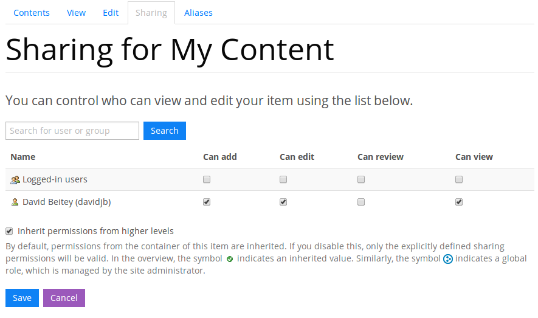
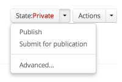
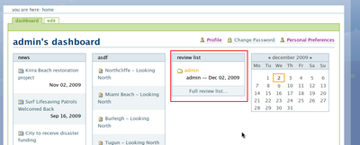

.. _managing-content:

Managing and publishing content
*******************************

|project-name| offers extremely flexible and granular security for content
items that are stored on the site.  Content can be shared with individuals or
groups of users following :ref:`sharing-your-content`, and content can be
published to the public with :ref:`publishing-content`.

Permissions overview
====================

First, make sure you're aware of what roles can be granted to individuals
or groups of users.  A level of access below corresponds to a role for a
particular area of the site.

.. important::
   Take care when assigning access to other users. Always double-check the
   person or group you are sharing with is correct and that you trust them with
   the access you're providing. Also make sure you are granting a suitable
   level of access to the right range of content.

.. warning::
   Granting users more access than they require can be both useful, and
   potentially dangerous.  Take care.

.. _access-types:

Access types
------------

==========           ========================================================
Access               Description
==========           ========================================================
Can add              Allows new files to be uploaded or content items to be
                     created in this folder, granting access to the ``Add new``
                     menu. This has no effect on non-folder content.
                     Corresponds to the ``Contributor`` role.
Can edit             Allows editing of existing content, granting access to
                     the ``Edit`` tab against content. Corresponds to the
                     ``Editor`` role.
Can review           Allows the user to publish and review content, granting
                     access to extra controls in the ``State`` menu.
                     Corresponds to the ``Reviewer`` role.
Can view             Allows the user to see private or non-shared content. Use this
                     permission to grant access to specific folders and
                     content areas on a portal. Corresponds to the ``Viewer``
                     role.
==========           ========================================================

.. _roles:

Roles
-----

The core content-centric roles are as follows:

Contributor
    Users can create content in the areas they have been granted
    this role. This provides access to the ``Add new`` menu.
Editor
    Users can modify and delete content where they have been granted this role.
    This provides access to the ``Edit`` tab and controls for deleting and
    moving content.
Reviewer
    Users with this role can publish and retract content from being accessible
    to the public. This provides access to the ``State`` menu.
Viewer
    Users with this role can see content that is in the **Private** workflow
    state.

.. only:: admin

    For site administration purposes, there are two additional special roles:

    Site Adminstrator
        Special site-wide role for administrators granting access to all content
        and all content management abilities.  Can adjust most site setup
        configuration options, with the exception of managing complex and
        lower-level system settings such as the :term:`Zope Management Interface
        (ZMI)`.
    Manager
        Special site-wide role with all permissions and abilities.  Users with this
        permission are effectively super users and can do everything, everywhere.

Local and site-wide roles
-------------------------

Roles can be applied to grant users permissions in one of two different ways,
either as ``local`` roles or as ``site-wide`` roles.

.. _local-roles:

**Local roles** are applied just for a specific area on the site, being either a
specific content item, or for an entire folder.  This is the most typical
manner in which to grant users access to content because it can be controlled
on a very granular level.  For example, a certain user or set of users should
have access to a certain folder or file, whilst other users should not.  This
is the process described under :ref:`sharing-your-content` and users are able
to self-manage permissions without requiring a site administrator's
assistance.

.. _global-roles:

**Site-wide** or *global* roles are applied by a system administrator and
grant a given user or set of users access across the entire site.  This is
useful in the situation where a user is a content administrator or review
personnel for all content across a site.  Care should always be taken which
granting any unrestricted access across a site.

.. _sharing-your-content:

Granting access to your content
===============================

.. ifconfig:: 'group-management' not in tags

   .. important::

      The creation of groups for sharing is not supported by |project-name|.

   Sometimes you'll want to give access to individuals rather than the whole
   Internet; you can choose to share your document with a particular person.

.. ifconfig:: 'group-management' in tags

   Sometimes you'll want to give access to individuals rather than the whole
   Internet; you can choose to share your document with a particular person or
   a group of users.  Granting access by groups is dependent on how the site
   administrator has configured the system.

.. important::
   Keep in mind if you see this message:

   .. image:: images/default_view.png
      :alt: The default view message
      :align: center

   then you should take care to decide whether you want permissions to apply to
   this content item (the default view for the folder) or whether you want the
   permissions to apply to the **whole** folder.  In almost all cases, you will
   want to click the ``go here`` link and apply permissions to the folder.

In order to selectively grant access to some content:

#. Browse to the piece of content that you'd like to share, or browse
   to the folder that surrounds the content if you'd like to grant
   access to the entire folder.

#. Click on the ``Sharing`` tab 

#. Search for a name by typing it into the search box and clicking the
   ``Search`` button. You can also search for partial names, email addresses,
   or user IDs as well.

#. When the appropriate entry appears, select the permissions in the same row
   to grant different types of access.  You should refer to :ref:`access-types`
   mentioned above if you're unsure what each permission does.

#. Click the ``Save`` button to make the changes. Permission changes take
   effect immediately.

Sharing with all logged in users
--------------------------------

.. note::
    Be extremely careful and ensure this behaviour is what
    you want.  Contact your site administrator if you're unsure.

It is possible to share content with anyone who is able to log into
|project-name| by selecting the ``Logged-in Users`` entry that appears on the
``Sharing`` tab, and granting permissions to this special group of users.

Keep in mind that by providing access in this way, all users on your site
(which may be many different users) will be granted permission to your content.

Inheriting permissions
----------------------

The ``Inherit permissions from higher level`` checkbox controls whether the current
content item or folder uses the same permissions as the parent folder.
This means that the permissions are inherited **downwards** from higher levels.

You may wish to enable or disable this functionality depending on your security
requirements.  For example, if you want one specific area to have customised
security, then you may want to disable this option.  Alternatively, if you want
security to automatically apply from the higher-level folder, leave this
enabled.  For sharing-based access, the page will always display the resultant
security settings for you to peruse.

To enable or disable this functionality:

#. Select or deselect the checkbox on the Sharing page.

#. Click the ``Save`` button to make the changes.  The page will refresh and
   show you the resulting access permissions for the content item or folder.

Workflows and document publishing
=================================

.. note::
   Workflows play an important role in content security and control who can see
   the content, inclduing whether it is accessible to the public.

What is a state and what is a workflow?
---------------------------------------

A :term:`state` is a condition that a piece of content is in as part of a
:term:`workflow`, which is a process that your content passes through before it
becomes available to others on |project-name|. 

The :term:`state` controls visibility and overarching permission to access the
content.  When an item is first created, its state is **Private**.  Typically,
users will require their content to be reviewed (placed into the **Pending**
state) before it is published to the public (the **Published** state). Full
details about what each of these relates to are outlined in `Workflow states`_.

Users without the ``Can review`` permission (or ``Reviewer`` role) are
prevented from making content available to the public.  This process commonly
requires a content manager or site administrator to be part of the workflow to
ensure that content posted meets standards set by you or your group. In some
cases, this may not be very important, if all users should be able to publish
documents, but is imperative in others, such as when all content **must**
remain private or when content must be reviewed prior to posting.

.. note::
   Whilst this sounds onerous, in the case of simpler environments, the
   workflow process may be as simple as *'all content is private'* or *'no
   approval is necessary'* with the appropriate configuration in place.

Workflow states
---------------

At each point in the workflow your document will have a different state.  These
states are listed below:

+-----------+------------------------------------------------------------------+
| State     | Description                                                      |
+===========+==================================================================+
| Private   | * Only visible/editable by creator and site administrators       |
|           | * Can be shared with individuals via ``Sharing`` tab             |
|           | * Must be published before being visible to public               |
|           | * Content managers can publish immediately                       |
+-----------+------------------------------------------------------------------+
| Pending   | * Has been submitted for review through workflow                 |
|           | * Awaiting a decision from content manager or site administrator |
|           | * User with ``Reviewer`` role may publish or reject this         |
|           | * Accessed in the same way as other **Private** content          |
+-----------+------------------------------------------------------------------+
| Published | * Are available to all site visitors                             |
|           | * Visible to the public, without login                           |
|           | * Content managers can retract back to being **Private**.        |
+-----------+------------------------------------------------------------------+

.. only:: files_images_have_state

   For |project-name|, ``File`` and ``Image`` content types
   are configured specially to inherit the parent folder's workflow state.
   This means that if the surrounding folder is **Private** then the files or
   images will be as well.  The same applies to publishing content - in order
   to publish files or images, then the surrounding folder must be published.

.. _state-menu:

The State menu
--------------

Changes to a piece of content's workflow state (and thus its visibility) are
controlled via the ``State`` drop-down menu, visible when you are viewing that
piece of content.

This menu also displays the current state of your content, which is
colour-coded to suit.  This colourisation will be shown elsewhere on
|project-name|, such as in navigation and in folder listings, to help you
identify the state of content.

In addition to being able to change the state of the current content item, when
looking at folders, the menu also provides an ``Advanced`` link.  This advanced
page allows fine-grained control over changing several items at once, and
changing all items within sub-folders.

.. _publishing-content:

Creating public content
=======================

Private content is extremely useful for many purposes, but there will typically
come a time that you need to publish content to the public.

#. If you haven't already, proceed with the instructions for
   :ref:`creating-new-content` first.

#. Browse to the content item that you would like to make public. It is also
   possible to publish a folder as well using the same process.

#. Click :menuselection:`State --> Publish`.

   a. If you can't see this, then you don't have access to publish documents.
      If you feel you should have this access, you'll need to contact your
      content manager or site administrator for access.

   b. If you see ``Submit for publication`` under the menu instead, then click
      this and the content will be submitted to your content manager for
      approval.  You will need to now alert the relevant person to publish the
      content for you.

Reviewing content
=================

.. note::
   If you have suitable permissions, you'll have the ability to review content
   for yourself and other users. Content manager and site administrators have
   this permission by default.

The review list is shown on your dashboard when you have review permissions and
there are items to review. This list contains items that have been submitted by
other users for review. Your dashboard can be accessed via :menuselection:`User
menu (your name) --> Dashboard`.

If you don't see this on your dashboard, you can add it easily via
:menuselection:`Edit --> Add portlet` -- it's called a
``Review list portlet``.

Reviewing an item
-----------------

In order to review a given content item:

#. Visit your dashboard and click the link to the item for review.  Otherwise,
   browse to the content item to be reviewed.

#. Use the State drop-down menu (see :ref:`state-menu`) to make a decision
   regarding either publishing or rejecting this item.

At this point you have the following choices for this item:

Reject the item
    Reject the item by selecting ``Send back`` from the ``State`` drop-down menu.

    + You would reject the item if you feel that it is not appropriate for the 
      site, or if it requires more work.

    + This returns the item to the ``Private`` state.

    + If you want to add comments describing why the document was rejected, click
      onto :menuselection:`State --> Advanced` first before rejecting it. Enter
      your comments here and select ``Reject`` to change the document's state.
Approve the item
    .. important::

        Keep in mind that you may need to adhere to organisational policies or
        procedures when publishing documents on the web. The publishing process is 
        your responsibility and your username is associated with all publications.

    Approve the item by selecting ``Publish`` from the ``State`` drop-down menu.

    + This changes the content into the **Published** state.
    + The content is now publicly available on the Internet.
Edit the item
    As the reviewer, you have permission to edit the document yourself. You can make
    any changes that are necessary and then approve the item.
Do nothing
    If you’re not sure whether this item is suitable or not, you can simply leave it
    as it is.

    This will leave the document in its **Pending** state for the time being.
    Keep in mind that it will eventually need to be either approved, edited or
    rejected.  You may wish to seek advice from another site administrator or
    reviewer about the content.

Editing a published document
============================

In order to make an edit to a previously published document, there are two 
choices, depending on who you are:

Content authors
    + The original author can choose ``Retract`` from the State drop-down menu,
      which moves the document back into the ``Private`` state.
    + The author can then make changes and save the content, and add it back 
      to the review list using the **State** menu.
    + It must be approved by the reviewer or content manager and to be
      published again.
Content managers
    + Content managers or site administrators can edit any document or content.
    + Upon editing content, it is republished without the need to go through the 
      workflow process again.
    + Take care when making changes as they become immediately visible.

Publishing a folder
===================

You can choose to make folders public if you would like to share the data
within it. As with all other publication of content, this can be reviewed later
if necessary.

.. only:: files_images_have_state

   .. important::
       On |project-name|, file and image content items inherit the workflow
       state of their parent folder.  This means that if you include these
       content items inside pages or otherwise link to them, they will not be
       available to the public until you publish their folder (or move them
       into a published folder).

The same workflow associated with normal content applies to folders, so refer
to :ref:`publishing-content` for more information.

Checking access permissions
===========================

There are a number of different areas where permissions can be granted in
order to allow other users or the public access to your content.  The
following is a summary of where to look and what to check if you're
experiencing any issues with access:

#. Check the workflow state of the item (the :menuselection:`State`
   menu). In order to only share with select people, ensure the state is
   set to private.

#. Check the ``Sharing`` tab on the content item.  This view displays
   all applicable customised permissions, including those that are
   being inherited from parent or higher-level folders.

#. Check the permission inheritance setting on the ``Sharing`` view.
   This can be toggled on or off to control whether permissions from
   parent folders are inherited by this content.
