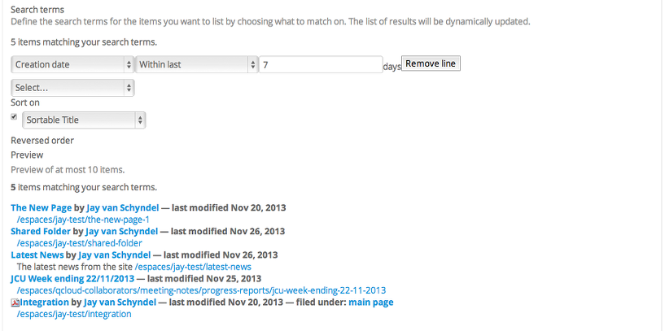
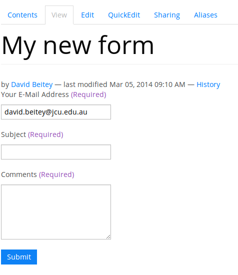
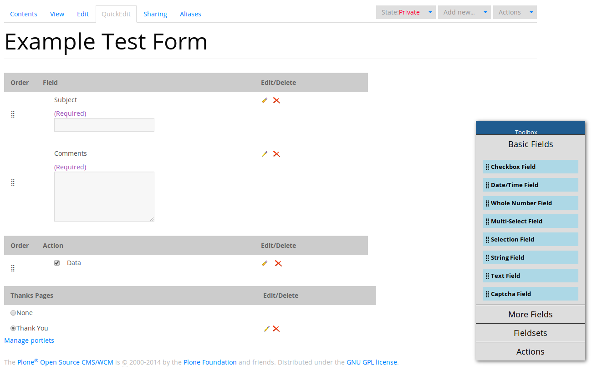
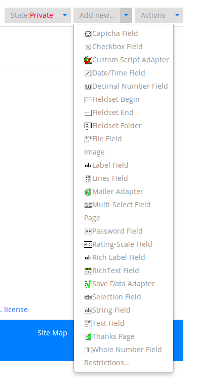

Using other types of content
****************************

Adding images
=============

**You can upload images to your site for inclusion in your Pages or for separate display.**

Images may be added by selecting image from the **add new**  menu on the portal menu bar.

.. image:: images/add_new_menu1.png
   :alt: Add new menu
   :align: center

If the image is of type . **gif** , **.jpg**  or **.png** , it should be 
viewable in the web browser and the image will not need to be downloaded 
separately. The metadata for an image is very much the same as any other 
type of document.

Adding and editing events
=========================

**You can create events on your portal for others to see.**

In order to add an event to the calendar, select **event**  from the Add 
New drop-down menu.

.. image:: images/add_new_menu1.png
   :alt: Add new menu
   :align: center

The following metadata items are required. Although not required, **Location** 
is a useful bit of information to include.

+-----------------+--------------------------------------------------------+
| Metadata item   | Description                                            |
+=================+========================================================+
| Title           | A short description of the event                       |
+-----------------+--------------------------------------------------------+
| Description     | More details about the event                           |
+-----------------+--------------------------------------------------------+
| Location        | Where the event is going to be held                    |
+-----------------+--------------------------------------------------------+
| Event starts    | Date/time in the format                                |
+-----------------+--------------------------------------------------------+
| Event ends      | Date/time in the format                                |
+-----------------+--------------------------------------------------------+
| Attendees       | List of people who are to be attending                 |
+-----------------+--------------------------------------------------------+
| Event URL       | A web address related to the event                     |
+-----------------+--------------------------------------------------------+
| Contact Details | Various details about whom to contact about the event. |
+-----------------+--------------------------------------------------------+

Adding and editing News items
=============================

**You can also add and edit News items on the portal.**

.. image:: images/add_new_menu1.png
   :alt: Add new menu
   :align: right

News items are created in the same way as other documents, but will appear
under the News tab or portlet once the item is published. The type of display
will depend on your portal's configuration.

To create a News item, click **News item**  from the add item menu on the 
Plone bar.

Enter the information for the content and click the **Save** button.

.. note::

   only **Title**  and **Body**  text are required.

+---------------+--------------------------------------------------------+
| Metadata item | Description                                            |
+===============+========================================================+
| Title         | A short descriptive title                              |
+---------------+--------------------------------------------------------+
| Summary       | A paragraph long description of the document           |
+---------------+--------------------------------------------------------+
| Body Text     | The main text of the document.                         |
+---------------+--------------------------------------------------------+
| Image         | An image to appear as part of the news item. Click the |
|               | browse button to choose the image                      |
+---------------+--------------------------------------------------------+
| Image Caption | The text that will appear under the image              |
+---------------+--------------------------------------------------------+

Adding Links
============

**You can create links within your portal. These act essentially as bookmarks or favourites to other web pages or sites.**

Links can also be added into Plone. When a user clicks onto a given link, they'll be automatically taken to the target of the link. 

.. note::
   if the user has access to edit a given Link, then they'll be taken to a view explaining the link.

To add a link, choose **Link**  from the **Add new**  menu.

.. image:: images/add_new_menu1.png
   :alt: Add new link
   :align: center

Add the metadata.  Only **Title** and **URL** are required.  To finish, click the 
**Save** button.

+-------------+-------------------------------------------------------------+
| Metadata    | Description                                                 |
+=============+=============================================================+
| Title       | A short description of the link                             |
+-------------+-------------------------------------------------------------+
| Description | A longer description of the links.Can be a few sentences in |
|             | length                                                      |
+-------------+-------------------------------------------------------------+
| URL         | The complete url for the link                               |
+-------------+-------------------------------------------------------------+

Organise your content using folders
===================================

**Folders are typically used to structure your physical content into a 
logical fashion; you can use them on your portal too.**

You can create folders within your folder in order to store your content in a 
logical fashion, making it easy for others to find your files.

To add a new folder, navigate to the place where you want the folder to be created and 
choose **folder** from the **Add New** drop-down menu.

.. image:: images/add_new_menu1.png
   :alt: Add new folder
   :align: center

The metadata for folders is very simple. Just add a **Title**  and a 
**Description** for the folder. You can now add content into this folder, 
like you would on your normal computer desktop!

Publishing a folder
-------------------

You can choose to make this folder public if you would like to share the data
within it. This can be changed later if necessary.

The same workflow associated with normal content applies to folders, so have 
a look at :ref:`creating-public-content` to see how.

Adding a Collection
===================

**A collection is a bit like a saved search - it allows you to display a list
of contents from the site that matches some pre-specified criteria.**

For example, you might be interested in:

- New content - all content created on the site in the last 7 days
- About to expire content - all content with an expiration date with the next 7 days
- Your content - all content created on the site by you.

To add a collection, simply select the Collection type from the **add new**
menu. You need to give the collection a Title and add *Search Terms*. Once your
are satisfied with the results, click *Save*.

In the example below, The collection displays all content created in the last 7
days. Use the combo to add different search criteria. A preview of the results
will be displayed. 

   
The search criteria for the collection can be based on any of the meta-data
associated with content.  Some of these are listed below but there are more:

- Title
- Tag - the keywords used to describe an item
- Creation Date - time and date an item was created
- Creator - user who created the content
- Review State - the contents workflow state e.g. published or private
- Expiration Date - the time and date the content will no longer be available
- Location - where in the site the content resides

Creating online forms
=====================

You can easily create web-based forms to capture information from users.  
Forms can be created such that the results are either emailed to a user
or group of users on submission, or else saved in a local file on the site,
available for download at any time.  Plone forms have a large number of field
types available, and one notable benefit is that your forms can be used
within your site's existing security, rather than relying on a third-party
provider.

Basic concepts
--------------

A web form has this general workflow:

* Display the front-facing form to a user.  This form typically
  consists of a number of fields, which might include input boxes,
  drop-down or radio button lists, file uploads, and more.
* The user visits the form and fills out the details.
* The user clicks the submit button to send form information
  to the server.
* The server processes the form submission, validating it (if configured)
  and returns any errors to the user.  This might happen if a field
  is configured as ``Required`` but the user did not enter a value.
* This continues until the form submission is correctly submitted.
* The server then processes the form submission according to the actions
  on the form.  For a typical form, this is either emailing the results
  to someone or storing in an online CSV file.
* The server displays a thank-you page or similar to the user.

There can be variations on the above, given your form, but typically,
this is the general process. 

Creating a new form
-------------------

To add a new form, navigate to the place where you want it to be
created and choose **Form Folder** from the **Add New** drop-down menu.

.. image:: images/add_new_menu1.png
   :alt: Add new form folder
   :align: center

The only option you're required to specify is the ``Title`` field, which
will dictate the heading and name of the form being displayed to users,
exactly the same way as other ``Title`` fields on other content do.

Here's a description of the options available:

=====================  =============================
Option                 Description
=====================  =============================
Title                  Short, descriptive title of the form
Description            A medium-length description of the form's purpose or action.
Submit Button Label    The text to display on the form's submit button
Show Reset Button      Select to show a reset button on the form, allowing the
                       user to clear their entry and start over Reset Button Label
Reset Button Label     The text to display on the form's reset button, if enabled
Action Adapter         Select which of the actions the form should take after submit.
                       If first creating a form, you'll just see 'Mailer' for emailing
                       results.  Others can be added later.
Thanks Page            Configure which page to show after the form has been submitted.
                       Typically, this will thank the user, or give them further instructions.
Force SSL connection   Force the form to be shown over a secure (SSL) connection.
                       Your Plone site must be configured specifically for this
                       functionality.  Consult your site administrator if in doubt.
Form Prologue          Rich text to display above the form. You may want to 
                       introduce your form, explain what it does, add friendly images,
                       and more.
Form Epilogue          Rich text to display below the form. You may want to 
                       sign off and say thanks here.
=====================  =============================

Once your form is created, you'll see a default form that looks a little
like this:

Using the Quick Editor
----------------------

Your form also comes with a simple Quick Editor, which allows you to drag
and drop fields onto your page, as well as easily edit and update 
your other form features.  You should familiarise yourself with 
`Form fields`_ and `Form features`_ so you know what's what.

Form fields
-----------

Once your form is created, you can add any number of fields to the form.
Each of the fields has a different purpose.  To add any of these to the form,
either use the Quick Editor (see `Using the Quick Editor`_), or otherwise
click the **Add New** drop-down menu, and choose the type of field you wish
to add.  You can hover your mouse over a field to see its description rather
than needing to rely on this list.

=====================           =============================
Field                           Description
=====================           =============================
Captcha Field                   Verification field the user must complete. This prevents misuse and spam. 
Checkbox Field                  True or false field where the user can choose to select or deselct the box.
Date/Time Field                 Field that captures either a date, or date and time.
Decimal Number Field            Text field that validates input to ensure decimal numbers are entered.
Fieldset Begin                  Marker indicating the start of a fieldset (group of fields)
Fieldset End                    Marker indicating the end of fieldset (group of fields)
Fieldset Folder                 Folder-like entity that can contain fields.
File Field                      Upload field for files from the user. Use with caution as users may upload
                                undesirable files. Files uploaded are attached to mail sent on form
                                submission.
Label Field                     Basic label-only text field. Useful for displaying some short text.
Lines Field                     Input field for multiple lines of text (such as a list of text values)
Multi-Select Field              Selection list or checkbox list for multiple values.
Password Field                  Input field for passwords (protects visible input with stars or dots).
Rating-Scale Field              Multi-question field for rating a number of questions
Rich Label Field                Basic rich-text content to display on the form (no input).
RichText Field                  Rich-text content editor for capturing formatted content from the user.
Selection Field                 Single-selection field using either a drop-down list or radio buttons.
String Field                    Basic single-line text input field.
Text Field                      Multi-line text input field.
Whole Number Field              Text field that validates input to ensure integers are entered.
=====================           =============================

For each field, you will be presented with a number of different options for
customising that field. Have a read of each different option to get an idea
as to what they do.  The most common options across fields are:

=====================  =============================
Option                 Description
=====================  =============================
Field label            Short, descriptive title of the field for display on the form. 
Field help             A medium-length description of the field's purpose or similar help text.
Required               Whether the field is required or not.  If this is enabled 
                       for a field and the user does not enter a value, the form will error
                       during user submission.
Default                The default value to display on the form. This can be
                       used to help guide the user.
=====================  =============================

Other fields will have options like maximum length (for text fields),
available options (for selection or multi-selection fields), and so forth.
You can add new fields and change options with the knowledge you can easily
change things as you need at any time.

Once you've added your form field, you can see the result of the rendered
field by clicking back to your form.  

Form features
-------------

In addition to fields, there are also a number of form helpers that you can use.
These are added into your form in the same way as fields, by using the **Add new**
drop-down menu, and locating the relevant entry.

=====================           =============================
Special features
=====================           =============================
Image                           Standard image for inclusion in pages or thank you pages.
Page                            Standard page content. May be useful for extra help pages for forms.
Thanks Page                     A thank-you page that can be displayed after a form submission is
                                successful.  One is added automatically to new forms. Configure
                                which Thanks page to use via the Edit tab on your main form.
Mailer Adapter                  Enables a form to email submission results to recipients.
                                Enabled by default for forms, but you will need to configure
                                your email address for sending.
Save Data Adapter               Enables a form to save its data in a online-stored file.
                                Users' submissions are added into this CSV or TSV file and it
                                can be downloaded at any time by a suitable user.
Custom Script Adapter           Run custom script upon a form submission. Requires Manager rights
                                to create and use.
=====================           =============================

