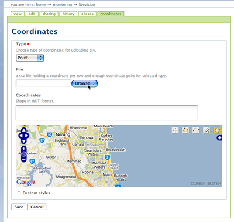
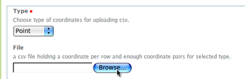
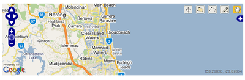
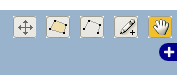
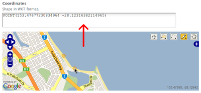
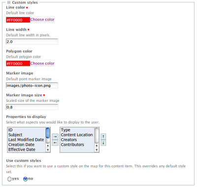
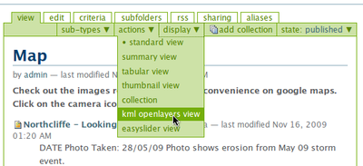
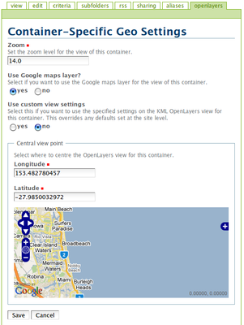
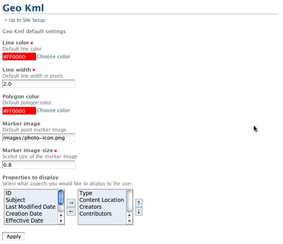
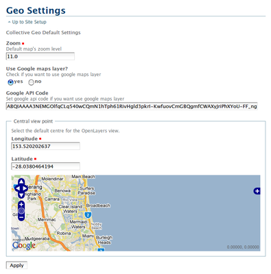

Special Customistations
***********************

Georeferencing Content
======================

**Georeferencing is an important part of the content on the site. Here's how to add 
geolocation data to content.**

Adding or uploading coordinates
-------------------------------

**You can apply coordinates or geometry information to any content within the portal.**

1. Browse to the content you wish to add coordinates to
2. Click onto the 'Coordinates' tab at the top of the content. You'll only see this if you have edit rights to the given content.

You'll see something like this:

**Uploading coordinates from a CSV**

The format of your CSV must be *longitude*, *latitude* - the format used by most computational 
geometry programs (x, y). Inputting these details the other way around will not work and will 
make your content appear incorrectly in the world or not appear at all.

1. Select what type of coordinates you're uploading in the drop down menu.
2. Click onto the 'Browse' button and find the CSV file on your computer.
3. Follow the steps to save your coordinates below.

**Manually entering coordinates:**

If you know the precise coordinates you want, then you can enter them manually here.  Details are inputted using WKT format, examples of which are:

- POINT(153.6273193359375 -28.21970990898648)
- LINESTRING(153.52844238281253 -28.125283321961742,153.83056640625 -28.125283321961742,153.83605957031247 -28.29228897739707,153.929443359375 -28.297125824492888)
- POLYGON((153.98162841796875 -28.151924899329817,154.14916992187503 -28.10832614221258,154.22882080078125 -28.28019589809702,154.06402587890622 -28.32855997136169,153.98162841796875 -28.151924899329817))

Take care when using this method and make sure your formatting is correct.

**Selecting geometry on the map**

Finally, you can select your location on the OpenLayers map on the screen:

   
1. Using the map, zoom/scroll/move to the area you want to select as your geometry. You may want to zoom in very close to make sure you get things correct.
2. Choose what type of geometry you want from the toolbar.

In order from left to right, these buttons do the following:
  - Move tool - Move existing geometry points around (helpful for changing polygons or lines)
  - Polygon tool - Create a new or overwrite an existing polygon.
  - Line tool - Create or overwrite an existing polyline.
  - Point tool - Create or overwrite an existing singular point.
  - Hand tool - Drag to scroll your map with your mouse.
      
3. Click on the map to add your geometry.  Your changes will propagate up into the WKT input box:

       
**Saving the results**

When done, click onto the 'Save' button to commit your changes.  If there are any problems with your input, the site will tell you.

Adding custom styles to geometries
----------------------------------

**You can customise how you want your content's coordinates to appear on the OpenLayers (map) view.**

1. Click onto the content you want to change styles for
2. Click onto the coordinates tab at the top of the content
3. Scroll down to find the 'Custom styles' collapsed menu and click onto it to reveal this:

   
4. Enter your custom details here or select them from the relevant control.
   - Line colour - what colour you'd like if your coordinates are a polyline
   - Line width - width of your line
   - Polygon colour - colour for your polygon coordinates
   - Marker image - input a fully-qualified URL to an image to use as your icon on the map for a single point.
   - Marker image size - the scaled size (for example, 0.8 equals 80%) of your icon for your single point.
   - Properties to display - select what metadata to show in your pop-up balloon
5. **Important**: if you want your custom styles to show up, select *'Use custom styles'.* Without this, your settings won't get applied and the defaults will remain.
6. Click onto the Save button on the page to save your changes.
7. Your changes should now be visible if you look at an OpenLayers (map) view for the surrounding folder for this content.

Setting a container to display a map
------------------------------------

**If you want to show your content's geolocations, here's how.**

For any collection or folder in the portal, you can choose to display this as a 'KML OpenLayers View'.
Essentially, this means that you can turn a folder into a map, and have the geometries of the
objects in this folder appear on the map.

To do this:

1. Browse to the folder or collection you want to set as a map
2. Click onto the Display menu and select 'KML OpenLayers View'

   
3. Your container is now displaying as map. If your Collection had results, and those results had coordinates attached, then you'll see the results all aggregated here. Likewise, if your Folder has contents, and these contents had coordinates attached, then you'll see them all here.
4. You can follow the instructions on the proceeding page to customise the display of the view.
   
Configuring the display of a container's map
--------------------------------------------

**If the default settings aren't suitable, you can change the zoom, location, or other aspects of a container's map.**

In order to set the configuration of a given container's OpenLayers view, you can use the specific settings form.

1. Browse to the folder or collection you've set to have the OpenLayers view as its default display
2. Click onto the 'OpenLayers' tab at the top of the page.  You'll now a form similar to this:

   
3. Change the options you want on the page, ensuring that you select **Use custom view settings** if you want these to apply over the default, site-wide settings.
   - **Zoom** - set how far the map should be zoomed in initially
   - **Use Google maps layer?** - use OpenStreetMap if this isn't selected.
   - **Central view point** - choose where to focus the map initially.  Keep in mind that this map you pick your central point on won't precisely match the one users see (due to width, zoom, etc).
4. When done, click the Save button and your changes should be immediately visible.

Configuring Site-wide KML settings
----------------------------------

**The display of geometry within OpenLayers (map) views is controlled through the use of KML-related settings. 
This includes line colours, polygon colours and metadata display.**

1. Click onto Site Setup in the main site links listing.  You won't see this link if you're not a site administrator
2. Click onto KML Settings in the control panel.
3. You'll see this page:

   
4. Enter your settings.  See 

.. _Adding custom styles to geometries:  http://eresearch.jcu.edu.au/support/plone/manual/User/special-customisations/georeferencing-content/adding-custom-styles-to-geometries

for details about what each setting does. Keep in mind that here the marker image field is **relative** to the site root.  
5. These settings will apply to any and all content that doesn't have **Use custom styles** enabled on its coordinate settings, and likewise will be the defaults applied to any new content in its custom styles settings.
6. When done, click the 'Apply' button to save your changes.
   

Configuring Site-wide OpenLayers settings
-----------------------------------------

**The display of maps themselves within OpenLayers (map) views is controlled through the use of 
these settings. This includes the Google Maps API key, default map zoom level and others.**

The settings page can be accessed thus:

1. Click onto Site Setup in the main site links listing.  You won't see this link if you're not a site administrator.
2. Click onto Geo Settings in the control panel.
3. You'll see this page:

   
4. Enter your settings.  See 
.. _Configuring the display of a container's map: http://http://eresearch.jcu.edu.au/support/plone/manual/User/special-customisations/georeferencing-content/configuring-the-display-of-a-containers-map

 for details about what each setting does. The only different setting here is the Google API Code field -- this should only be changed if you've changed the URL for the site.
5. These settings will apply to any and all folders/collections that don't have 'Use custom settings' enabled on its OpenLayers settings, and likewise will be the defaults applied to any new containers in its OpenLayers settings.
6. When done, click the 'Apply' button to save your changes.

Configuring content for date-based searches
===========================================

**Users have the option to search for a given date range on OpenLayers maps and in 
other areas of the site. Here's how you can make your content data-based search friendly.**

1. Go your content like normal by browsing to it.
2. Click onto the **Edit** tab at the top to start editing your content.
3. Click onto the **Dates** tab on the page.
4. Select the relevant date the content pertains to in the **Publishing date** field.  You can select dates outside of the periods in the drop-down menus by using the pop-up calendar, available by clicking on the calendar icon.

.. image:: images/calendar.png
   :alt: Calendar in Plone
   :align: center
   
5. Since searches are typically only date-based, you don't usually need to worry about the time fields at the end unless you know you're doing something specifically time-sensitive.
6. Click the **Save** button at the bottom of the field. Your changes are now saved.

Customising the JCU Theme
=========================

**The eResearch site is styled using the JCU Theme which comes in 4 schemes: Red, Blue, 
Green and Orange. You can configure different sections of the site to use different schemes.**

The eResearch site conforms to the JCU web theme. The top navigation bar can be configured to use 
either the green, blue, red or orange gradient background. By default, the theme used on any particular
page is the same as that used on its parent folder, so changing the theme on a folder effects all 
the items contained within that folder. However, you can set the theme for individual pages if you wish.

To change the theme, click on the *Theme link* above the page content. You will only see this link if
 you are logged in and have edit permissions on the content.

missing image

The theming options page:
- shows you the current theme settings for the content,
- lets you set/change the colour theme to be used,
- allows you to keep the current settings but ignore them, or
- lets you delete the settings.

To select a theme, choose a style from the **Theme Name** drop down menu.

missing image

After applying the theme selection, view the content to see the new look.

missing images.
