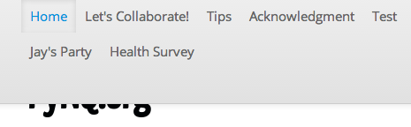

Frequently Asked Questions - FAQ
================================

I've created a page, but my custom script/embed/Flash/widget is being stripped
------------------------------------------------------------------------------

By default, |project-name| is configured to strip out all potentially dangerous
HTML from content being included.  The reason for this is that untrusted input,
especially from ``iframe`` and ``script`` elements can compromise site
security.

Contact your site administrator for more information and details about what
other options you may have for including your content.

The title bar is hiding my logo
-------------------------------

The title bar layout applies to all eSpaces and is designed for improve accessibilty. If your logo is 
hidden or obscured as shown below, eSpaces recommends reducing the number of first level items in your 
eSpace and keeping the titles short and descriptive.

Our suggestion is to group content into separate logical areas. The top level navigation items
in an eSpace also represent the menu on mobile devices and thus should be kept to a minimum. 
Following these suggestions will aid in the usability and presentation of your site and ensure 
your logo is visible.

.. _transferring-files:

Transferring files
------------------

The |project-name| service provides a WebDAV interface for the transfer of
multiple files and folders.

Obtaining your username and password
------------------------------------

.. ifconfig:: metadata['project']['auth'] == 'aaf'

    On |project-name|, authentication typically occurs with existing research
    institution credentials using Single-Sign-On.  Because your credentials
    are only ever managed by you institution, you must utilise the special
    credentials local to |project-name|.

    #. Username:

       #. On your |project-name| site, click on ``Sharing``.
       #. You will see a list of users, including your name. Your username is
          displayed next to your name. It is a long alphanumeric string.

    #. Password

       #. On your |project-name| site, under your username, top right hand
          corner, click on ``Preferences``.
       #. Click on the Password tab.
       #. Click ``Generate new password``.

.. ifconfig:: metadata['project']['auth'] != 'aaf'

   The credentials you log into |project-name| with are the same that you
   should utilise for connecting to transfer files.  If you have forgotten your
   username or password, you will need to obtain these before proceeding.

Uploading Multiple Files and Folders (Windows)
----------------------------------------------

We recommend you use Cyberduck

#. Go to http://cyberduck.io/ and download Cyberduck.
#. Open the setup file you downloaded and install Cyberduck.
#. Launch Cyberduck from the desktop or start menu.
#. Click onto the ``Open Connection`` button on the toolbar.

   .. image:: images/cyberduck-openconnection.png
      :alt: Open Connection

   .. image:: images/cyberduck-settings.png
      :alt: Cyberduck Settings
      :align: right

#. In the pop-up window, configure the connection as follows:

   #. Select ``WebDAV (HTTP/SSL)`` from the top drop-down menu.
   #. Server: |project-server-host|
   #. Port: |project-server-port|
   #. Uncheck ``Anonymous Login``
   #. Username: 

      #. On your eSpace site, click on ``Sharing``.
      #. You will see a list of users, including your name. Your username is
         displayed next to your name. It is a long alphanumeric string.

   #. Password

      #. On your eSpace site, under your username, top right hand corner, click
         on Preferences.
      #. Click on the Password tab.
      #. Click 'Generate new password'.
   
   #. Path: "/<your eSpace Id>/" Obtain this from the url. e.g. https://espaces.edu.au/jay-test/
   
#. Click onto 'Connect' and your home folder should appear.
#. Now, drag and drop files to and from your desktop to this window, the folder
   on the site you've just connected to.
#. To save this connection, click onto the 'Bookmark' menu, and then 'New
   Bookmark'.  Enter and confirm any details you need and your bookmark is
   ready for easy access.

Uploading Multiple Files and Folders (Mac)
------------------------------------------

1. Using the Cyberduck client. See setup instructions under 'Uploading Multiple Files and Folders (Windows)' just above here.

2. Using the Finder client (for Mac OSX 10.4 or later).

   a. In the Finder, click onto the Go menu, and choose Connect to Server.
   b. Server Address: "https://espaces.edu.au/<your eSpace Id>" Just like your eSpace url
   c. If your system prompts you to verify the server's certificate, click Continue.
   d. At the authorisation prompt, enter your credentials and click OK.

      Username: 
         i. On you eSpace site, click on 'Sharing'
         ii. You will see a list of users, including your name. You username is displayed next to your name. It is a long alphanumeric string.   
   
      Password: 
         i.   On your eSpace site, under your username, top right hand corner, click on Preferences
         ii.  Click on the Password tab.
         iii. Click 'Generate new password'.
         iv.  Your new password is displayed in the 'Info' bar.
   
   e. You can now access your site from your computer, and copy files just as you would to anywhere else on your computer.

3. Older OSX Versions Details. It is recommended that you download and use Goliath - http://www.webdav.org/goliath/ 
   
Uploading Multiple Files and Folders (Linux)
--------------------------------------------

Gnome-based Systems
^^^^^^^^^^^^^^^^^^^

Typically, Ubuntu and Debian operate with the Gnome desktop environment; follow these instructions if they suit your system.

1. Click onto the Places menu, and choose Connect to Server.
2. Under Service Type select either WebDAV (HTTPS) or WebDAV (HTTP) if you don't have the former.
3. Enter the following details:
    i.  Server: espaces.edu.au
    ii. Port: 443
    iii. Folder: "<your eSpace Id>" e.g: https://espaces.edu.au/<your eSpace Id>
    iv. User Name: 
         a. On you eSpace site, click on 'Sharing'
         b. You will see a list of users, including your name. You username is displayed next to your name. It is a long alphanumeric string.   

4. Check 'Add bookmark' if you want to save this location for later (and enter a bookmark name).
5. When the Enter Password prompt appears, enter your site password.  You can choose to remember the password, if you so wish.
    i.   On your eSpace site, under your username, top right hand corner, click on Preferences
    ii.  Click on the Password tab.
    iii. Click 'Generate new password'.
    iv.  Your new password is displayed in the 'Info' bar.

6. The WebDAV folder should appear under your Places menu, and on the Desktop as well.  Drag and drop files into this location to copy them to your site.

Other Linux Variations
^^^^^^^^^^^^^^^^^^^^^^

Linux distributions vary widely, but on any system with a command line, you can follow these instructions.

The command line tool 'cadaver' is a WebDAV client. 

1. Install this program using something like yum install cadaver or apt-get install cadaver
2. Then connect using the command: cadaver https://espaces.edu.au:443/<your eSpace Id> just like your url
3. If you are prompted to accept the certificate, enter y for yes.
4. Enter your site credentials when prompted.

   User Name: 
    i.  On you eSpace site, click on 'Sharing'
    ii. You will see a list of users, including your name. You username is displayed next to your name. It is a long alphanumeric string.   

   Password:
    i.   On your eSpace site, under your username, top right hand corner, click on Preferences
    ii.  Click on the Password tab.
    iii. Click 'Generate new password'.
    iv.  Your new password is displayed in the 'Info' bar.

5. This tool operates in a similar fashion to FTP or SFTP with get, put and ls commands.  Enter help for more information.
