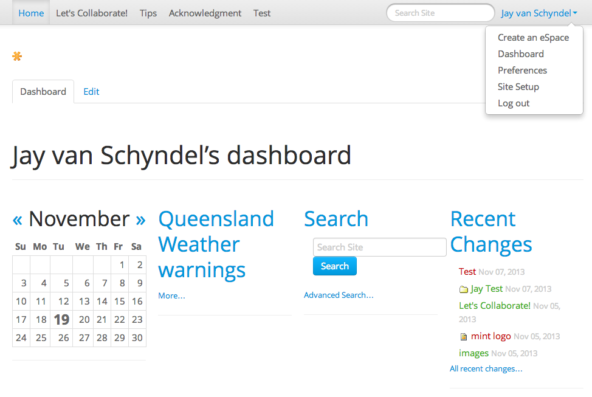

Using the Dashboard
===================

The portal has several built-in "views" of news, events, recently changed 
items, and such. These list views are held in discrete rectangular areas
called portlets. Think of a portlet as a window view of a given type of 
content. For example, the news portlet offers a view of recently published
news items.

You control which portlets you view in your dashboard, and where they are
placed. The following screen capture shows what a user might see on their
dashboard:

Accessing the dashboard
-----------------------

1. Click onto your own name in your user actions toolbar (at the top of
   the site).
2. Select *Dashboard*.

Editing your dashboard
----------------------

1. Once you are looking at your dashboard, click the 'Edit' tab at the top.
2. You can now select new porlets for your dashboard or reorganise the ones
   that already exist.

Details about dashboards
------------------------

A new user account on the portal will have an empty dashboard. Depending on what 
is installed for the site, the user can customise the portlets they want to see
and where to place them within the four columns.
