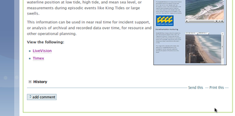

Interacting with content
************************

Commenting
==========

Comments are an important part of collaboration and allow you to provide
feedback or visibly expression opinions.

With the exception of folders, almost all types of content can be enabled to
allow comments. If comments are enabled for a particular content item you will
see a comments section underneath the content, and an ``Add comment`` button.
If this isn't visible, see `Enabling or disabling comments`_ for how to turn
commenting on.

Enabling or disabling comments
------------------------------

.. note::
    You requre access to edit a given content item in order to control comments.

#. Browse to the content item you wish to adjust comments for.

#. Click on the ``Edit`` tab.

#. Click onto the ``Settings`` tab on the page to reveal extra settings
   for this content.

#. Enable or disable the ``Allow comments`` field as required.

   If you can't find the field here, it might be under a different tab, such as
   ``Properties``. Some custom content types can adjust where options are
   displayed.

#. Click the ``Save`` button to make the change.

#. The page will reload and display your content with its new settings applied.

If you enabled commenting, the comments field will be displayed.  Likewise, if
you disabled commenting, comments will no longer be shown and the ability to
add comments will be removed.

Adding comments
---------------

.. note::
   The content item you wish to add comments to must have commenting enabled
   first.

#. Browse to the content item you wish to add a comment to.

#. Locate the *Comments* section at the bottom of the page. Depending on how
   long your page content is, you may need to scroll down the page.

#. Type your comments in to the field provided.

#. To save the comment, click the ``Comment`` button. You have the option of
   having |project-name| notify you via email of new comments made on the
   content by selecting the option provided.

#. Your comments will appear underneath the content on the page.

Replying to comments
--------------------

Replying to existing comments follows the same process as `Adding comments`_
above. 

#. Browse to the content item you wish to add a comment to.

#. Locate the *Comments* section at the bottom of the page. Depending on how
   long your page content is, you may need to scroll down the page.

#. Locate the comment that you wish to respond to and click the ``Reply``
   button against the comment.

#. Follow the remaining steps for `Adding comments`_.

Removing comments
-----------------

.. note::
   You must have access as a ``Reviewer`` (*Can Review* permission) in order to
   remove existing comments from content.  If you cannot see the ``Delete``
   button, you need to contact your site administrator for access.

#. Browse to the content item you wish to add a comment to.

#. Locate the *Comments* section at the bottom of the page. Depending on how
   long your page content is, you may need to scroll down the page.

#. Locate the comment that you wish to respond to and click the ``Delete``
   button against the comment.

#. The page will reload and show that the given comment has been removed.

Searching for content
=====================

|project-name| features a full-text search engine for quickly locating
documents and other content within the site.

.. image:: images/search.png
   :alt: Search

Enter text in the search box, and press the :kbd:`Enter` or :kbd:`Return` key
on your keyboard.  The site will search for all content which includes that
string in either the metadata or the text of the content. This includes
aspects such as the title of documents, descriptions, tags, and even
full-text inside files such as PDFs and Microsoft Office documents.

.. important::
   The search results will only ever show items that you have access to.  This
   also applies when logged out. No private content will ever be revealed
   to users unless permission has been granted.

.. _transferring-files:

Transferring multiple files and folders
=======================================

The |project-name| service provides a WebDAV interface for the transfer of
multiple files and folders.

.. _webdav-username-password:

Obtaining your username and password
------------------------------------

.. ifconfig:: metadata['project']['auth'] != 'aaf'

   The credentials for transferring files are the same as those that you use
   to log into |project-name|.  If you have forgotten your username or
   password, you will need to obtain these before proceeding.

.. ifconfig:: metadata['project']['auth'] == 'aaf'

    On |project-name|, authentication occurs either with existing
    research institution credentials using Single-Sign-On, or with local
    accounts that are independently managed inside |project-name|.

    If your account has not been issued by a research institution
    (university, CSIRO and so forth), then you should already know your
    username and password as you'll be using them to log into
    |project-name|.  If this applies to you, ignore the following
    instructions.

    If your credentials are managed by your institution, you must
    utilise special credentials on |project-name|.  To find these
    details:

    * Username:

      .. important::
         Your username is your ``Shared Token``. This is a long alphanumeric
         set of characters and is *not* your local institutional login.

      #. On your |project-name| site, locate any content item and click on
         ``Sharing``.
      #. You will see a list of users, including your name. Your username is
         displayed next to your name. It is a long alphanumeric string, and
         **excludes** the brackets.
      #. If your name is not displayed here, use the search box to find
         your own account.

    * Password:

       #. On |project-name|, ensure that you are logged in.
       #. Click onto the top-right menu showing your name.
       #. Click ``Preferences``.
       #. Click on the ``Password`` tab.
       #. Click the ``Generate new password`` button.
       #. Take note of your generated password for use later.

WebDAV clients
--------------

Any standards-compliant WebDAV client should be able to connect to
|project-name| in order to transfer files and folders.  However, whilst there
are many clients that exist, including those which may be built-in to certain
operating systems (such as Windows and Mac), we recommend you use our
suggestions for an improved experience.

Tips and suggestions
--------------------

After uploading content, you may find that content is present within your site
(such as the ``Contents`` listings), but you cannot link to it from within Page
content.  If you experience this, you should add a Title to the given files and
documents, following the instructions for :ref:`renaming-content`.

Transferring multiple files (Microsoft Windows and Apple Mac)
-------------------------------------------------------------

.. important..
   For older versions of Mac OS X, it is possible to use the built-in Finder
   client (10.4 and 10.5), or `Goliath <http://www.webdav.org/goliath>`_ (10.3
   or earlier).

The recommended client is Cyberduck.

#. Go to http://cyberduck.io/ and download Cyberduck.

#. For Windows, open the setup file you downloaded and install Cyberduck.
   For Mac, open the downloaded disk image and copy the Cyberduck application
   to your local computer. Typically, you should copy this into your
   ``Applications`` folder.

#. Launch Cyberduck from the desktop or start menu (Windows) or from your
   Applications folder (Mac).

#. Click onto the ``Open Connection`` button on the toolbar.

   .. image:: images/cyberduck-openconnection.png
      :alt: Open Connection

#. In the pop-up window, configure the connection as follows:

   .. image:: images/cyberduck-settings.png
      :alt: Cyberduck Settings
      :align: right

   #. Select ``WebDAV (HTTP/SSL)`` from the top drop-down menu.
   #. *Server*: |project-server-host|
   #. *Port*: |project-server-port|
   #. Uncheck ``Anonymous Login``
   #. *Username*: see :ref:`webdav-username-password`.
   #. *Password*: see :ref:`webdav-username-password`.
   #. *Path*: The path entered here will be the starting folder that you
      connect to. For example, to connect to the top-level of the site,
      leave this empty; or, to connect to a specific folder or sub-site,
      enter ``/path/to/folder``, adjusting this example to fit your given
      URL.

#. Click onto ``Connect`` and you will be connected to |project-name|.

Now, you can drag and drop files from your local computer both to and from your site using this connection window.

To save this connection, click onto the ``Bookmark`` menu, and then ``New
Bookmark``.  Confirm that the details entered are correct and save your
bookmark.  Your bookmark is ready for easy access from Cyberduck's main
listing.

Uploading Multiple Files and Folders (Linux)
--------------------------------------------

Linux distributions vary widely, but on any system with access to the command
line and ability to install software, you can follow these instructions.

The recommended client is a command line tool called ``cadaver``. Distributions
that operate using GNOME with Nautilus as their file manager can also utilise
the built-in ``Connect to Server`` functionality, should you want to use a GUI.

#. Install ``cadaver``. Two common installation commands are::

       yum install cadaver

   or::

       apt-get install cadaver

#. Launch or otherwise access a terminal on your machine.

#. Start and connect to |project-name| with ``cadaver``, specifying the first
   argument to the command as the URL you want to connect to.  This example
   demonstrates connecting directly to a folder on |project-name|::

       cadaver |project-url|/my-site/folder

#. If you are prompted to accept the certificate, enter ``y`` for yes.

#. Enter your site credentials when prompted. See
   :ref:`webdav-username-password` if you require these credentials.

#. This tool operates in a similar fashion to the ``ftp`` or ``sftp`` commands,
   with ``get``, ``put`` and ``ls`` commands.  Enter ``help`` for more
   information.
