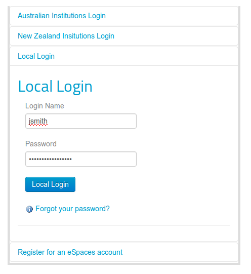
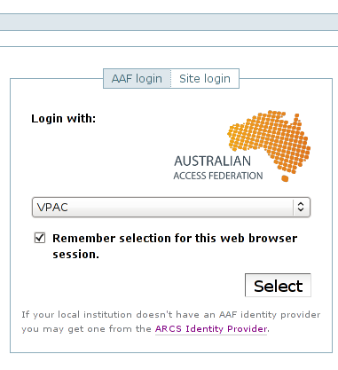
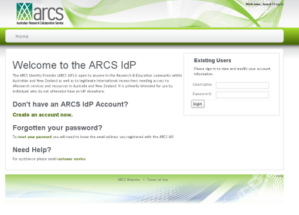

Logging in
==========

Being able to log in is the first key step.

In order for you to view secured content, or to add and edit files and pages
you must first login.

Plone Authentication
--------------------

1. The login link is usually located in the top right hand corner of the page.

2. Enter the user name and password that you have for the portal. If you don't
   have an account yet, please contact your site administrator.

3. Click the login button at the bottom of the page to login.
4. If you are unable to login, you will be taken to a different page, giving
   you the chance to login again.

AAF Authentication
------------------

1. The login link is usually located in the top right hand corner of the page.

2. If you have the option to login with shibboleth it will be presented in
   tab like format

3. Select the your Institution or Organisation from the dropdown box.
4. Click the *Select* button at the bottom of the page to login

.. note::

   If your Institution or Organisation doesn't appear in the list. Please
   apply for an account through the `ARCS Identity Provider
   <http://https://idp.arcs.org.au/idp_reg/>`_

.. note::

   This is a screen shot of the ARCS Idp login page, you institutions
   will look different.

5. Enter you Institutional/Organisational credentials and login.

To log out of the portal
------------------------
Click the *logout*  link. Typically this can be found in the top right corner or at the bottom of any portal page depending on your site design.

*Note*: if you are logged in via AAF Authentication, the only way to log out is to quit the browser you are using. Clicking on the *logout* link will give you a message to this effect.

If you cannot log in
--------------------

If you find you are unable to login to the portal, you may have forgotten
your password. If you believe this is the case, you can click onto the 'Login'
link the bottom right, and then read the instructions under 'Forgot your 
password?'. Follow these steps to try and change your password.

If you still can't log in, then contact your site administrator for assistance.

