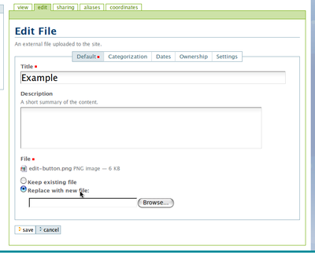

Managing your content
*********************

What is a workflow?
======================
.. Workflows play an important role in your portal's security and control who can see a document.

Workflows and document publishing
---------------------------------

A workflow is a process that your document passes through before it becomes available to others via the portal. This process ensures that content posted meets standards set by your administrator.\

When an item is first created, its state is **Private** .\Most users will require their documents be reviewed before they are published, requiring a section or site administrator to be part of the workflow.

At each point in the workflow your document will have a different state.\These states are listed below.

+----------------------+------------------------------------------------------+
| State                | Description                                          |
+======================+======================================================+
| **Private**          | * These items are only visible and editable by their |
|                      |   owners and site managers with administrator access |
|                      | * You can still share this content with certain      |
|                      |   people through the 'Sharing' tab.                  |
|                      | * Content in this state need to be published before  |
|                      |   being visible on the Internet.                     |
+----------------------+------------------------------------------------------+
| **Pending (submitted | * This content has been submitted for review         |
| for publication)**   |   through workflow and is awaiting a decision        |
|                      | * A site or section administrator with Review rights |
|                      |   needs approve this.                                |
|                      | * It can be accessed in the same way as other        |
|                      |   Private content                                    |
+----------------------+------------------------------------------------------+
| **Published**        | * These items are available to all site visitors     |
|                      | * They appear in the navigation tree, and are        |
|                      |   accessible through search                          |
+----------------------+------------------------------------------------------+

Reviewing content
=================
.. If you have the right permissions, you'll have the ability to review content
   for yourself and other users.

The review list on your dashboard when you log in as a user who has review
authorisation and there are items to review. The review list is a list of 
items that have been submitted by for review.

.. image:: images/review_list.png
   :alt: Review list

If you don't see this on your dashboard, you can add it easily -- it's called 
a 'Review list portlet'.

Reviewing an item
-----------------

Click the content link to open the item.

At this point you have the following choices for this item:

Reject the item
^^^^^^^^^^^^^^^

Reject the item by selecting 'Reject' from the 'State' drop-down menu choices.

* You would reject the item if you feel that it is not appropriate for the 
  site, or if it requires more work
* This returns the item to the Private state
* If you want to add comments describing why the document was rejected, 
  click onto the 'Advanced' option in the State menu first before rejecting 
  it. Enter your comments here and select 'Reject' to change the document's 
  state.

Approve the item
^^^^^^^^^^^^^^^^

Approve the item by selecting 'Publish' from the 'State' drop-down menu.

* This changes the content into the Published state
* The content is now publicly available on the Internet
* Keep in mind that you may need to adhere to organisational policies and/or 
  procedures when publishing documents publicly. The publishing process is 
  your responsibility and your username is attached to all publications.

Making changes as a Reviewer
----------------------------

Edit the item
^^^^^^^^^^^^^

As the reviewer you have permission to edit the document yourself. You can 
make any changes that are necessary, and then approve the item.

Doing nothing
-------------

If you’re not sure whether this item is suitable or not, you can just 
leave it as it is.

This will leave the document in its pending state for the time being. Keep in 
mind that it will eventually need to be either approved, edited or rejected.
You may wish to seek advice from another site administrator or content 
reviewer about the content.

Editing a published document
============================

.. Editing published content is another important process in content 
   management.

In order to make an edit to a previously published document, there are two 
choices, depending on who you are:

Authors
-------

* The author can chose **Retract** from the State drop-down menu, which moves 
  the document back into the Private state.
* The author then makes the change and saves the document which adds it back 
  to the review list.
* It must be approved by the reviewer/manager and to be published again

Managers
--------

* Any site administrator can edit any document or content.
* Upon editing content, it is republished without the need to go through the 
  workflow process again.

Adding an updated version of a file
===================================

.. A common task is updating a given file or image with a fresh version.

In order to upload a newer version of a file, you will need to edit that item.

1. Choose the item from the **contents view tab** in your folder, and then 
   click the **Edit** tab.

2. Only the fields with a red box are required, as when you create the content
   originally.
3. To update your file, click the **Replace with new file** radio button, and
   click the **Browse** button to select the new version of the file.
4. Click the Save button to commit your changes. 

Granting access to your content
===============================

.. Sometimes you'll want to give access to individuals or a group of users, rather than the whole Internet.

You can choose to share your document with all logged in users or with a 
particular person. Descriptions for how to set up each of these permissions 
are listed below.

To share with all logged in users:
----------------------------------

* Click on the Sharing tab
* You can add the following permissions by ticking the correct box in the 
  table next to "Logged-in Users":

 * Can Add - if this is a folder, a person can add a document to the folder
 * Can Edit - the person can edit any files in this folder
 * Can View - the person can read, but not edit the filesCan Review - the 
   person can approve this document for publishing

To share with an individual:
----------------------------

* Click on the **Sharing** tab 
* Search for an individual by entering a name in the search box and clicking 
  the **Search** button
* When the appropriate name appears, tick the correct box next to the name for
  the permission that you would like to add
* Click the **Save** button to save the changes

To share with a group:
----------------------

**Note:** groups are created by the site administrator

* Click on the **Sharing** tab
* Search for a group by entering a name in the searbox and clicking the 
  **Search** button
* When the appropriate name appears, tick the correct box next to the name 
  for the permission that you would like to add

Inheriting permissions
----------------------

The "inherit permissions from higher level" tick box means that the folder 
will have the same permissions as the parent folder.

* Click the **Save** button to save the changes

Enabling next/previous folder navigation
========================================

.. To make viewing the contents of a large folder more intuitive you may wish
   to enable the next/previous navigation feature. This is a simple task in 
   the Plone 3 environment.

To add next/previous navigation

* Make sure you are logged in
* Open the folder you wish to apply navigation to
* Click the **Edit** tab
* Click the **Settings** tab
* Tick the box marked **Enable next previous navigation** 
* Click the **Save** button

Transfering multiple files from your computer to Plone
======================================================
At times you may wish to upload multiple files to the portal.

The easiest method for doing this is to install and setup a WebDAV client, the connection protocol that you can use to connect to the site from your desktop.\

See one of the relevant tutorials for your operating system in `Usage Tutorials <resolveuid/5f66ce87d71439f43634dff9c774d7ff>`_ .

\

