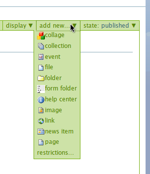

Using other types of content
****************************

Adding images
=============
.. You can upload images to your site for inclusion in your Pages or for 
   separate display.

Images may be added by selecting image from the **add new**  menu on the 
portal menu bar.

If the image is of type . **gif** , **.jpg**  or **.png** , it should be 
viewable in the web browser and the image will not need to be downloaded 
separately. The metadata for an image is very much the same as any other 
type of document.

Adding and editing events
=========================
You can create events on your portal for others to see.

In order to add an event to the calendar, select **event**  from the Add 
New drop-down menu.

The following metadata items are required.  Although not required, Location 
is a useful bit of information to include.

+-----------------+--------------------------------------------------------+
| Metadata item   | Description                                            |
+=================+========================================================+
| Title           | A short description of the event                       |
+-----------------+--------------------------------------------------------+
| Location        | Where the event is going to be held                    |
+-----------------+--------------------------------------------------------+
| Event starts    | Date/time in the format                                |
+-----------------+--------------------------------------------------------+
| Event ends      | Date/time in the format                                |
+-----------------+--------------------------------------------------------+
| Attendees       | List of people who are to be attending                 |
+-----------------+--------------------------------------------------------+
| Event types     | The type of event, meeting or so forth.  There can be  |
|                 | more than 1 type chosen.                               |
+-----------------+--------------------------------------------------------+
| Event URL       | A web address related to the event                     |
+-----------------+--------------------------------------------------------+
| Contact Details | Various details about whom to contact about the event. |
+-----------------+--------------------------------------------------------+

Adding and editing News items
=============================

.. You can also add and edit News items on the portal.

News items are created in the same way as other documents, but will appear
under the News tab or portlet once the item is published. The type of display
will depend on your portal's configuration.

To create a News item, click **news item**  from the add item menu on the 
Plone bar.

Enter the information for the content and click the **Save**  button.

**Note:** only **Title**  and **Body**  text are required.

+-----------------+--------------------------------------------------------+
| Metadata item   | Description                                            |
+=================+========================================================+
| Title           | A short descriptive title                              |
+-----------------+--------------------------------------------------------+
| Description     | A paragraph long description of the document           |
+-----------------+--------------------------------------------------------+
| Body Text       | The main text of the document.                         |
+-----------------+--------------------------------------------------------+
| Image           | An image to appear as part of the news item. Click the |
|                 | browse button to choose the image                      |
+-----------------+--------------------------------------------------------+
| Image Caption   | The text that will appear under the image              |
+-----------------+--------------------------------------------------------+

Adding Links
============

.. You can create links within your portal. These act essentially as bookmarks
   or favourites to other web pages or sites.

Links can also be added into Plone.\When a user clicks onto a given link, 
they'll be automatically taken to the target of the link. 

**Note:** if the user has access to edit a given Link, then they'll be taken 
to a view explaining the link.

To add a link, choose **Link**  from the **Add new**  menu.

Add the metadata.  Only Title and URL are required.  To finish, click the 
Save button.

+-------------+-------------------------------------------------------------+
| Metadata    | Description                                                 |
+=============+=============================================================+
| Title       | A short description of the link                             |
+-------------+-------------------------------------------------------------+
| Description |	A longer description of the links.Can be a few sentences in |
|             | length                                                      |
+-------------+-------------------------------------------------------------+
| URL         | The complete url for the link                               |
+-------------+-------------------------------------------------------------+

Organise your content using folders
===================================
.. Folders are typically used to structure your physical content into a 
   logical fashion; you can use them on your portal too.

You can create folders within your folder in order to store your content in a 
logical fashion, making it easy for others to find your files.To add a new 
folder, navigate to the place where you want the folder to be created and 
choose folder from the Add New drop-down menu.

The metadata for folders is very simple. Just add a **Title**  and a 
**Description**  for the folder.\You can now add content into this folder, 
like you would on your normal computer desktop!

Publishing a folder
-------------------

You can choose to make this folder public if you would like to share the data
within it. This can be changed later if necessary.

The same workflow associated with normal content applies to folders, so have 
a look at `Creating public content <resolveuid/4d3d0463ad254057e777e3dbc54b2be4>`_ 
to see how.
